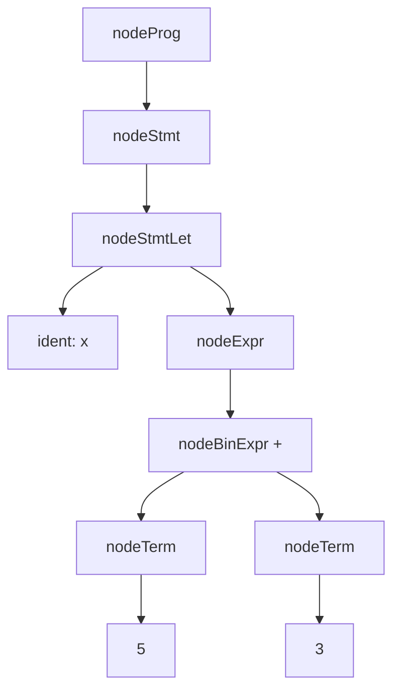

# Atom C++ Compiler

Atom is my test programming language. It is really simple. 

## Сборка


```bash
git clone https://github.com/dasha379/atom
cd atom
mkdir build
cmake -S . -B build
cmake --build build
```

## Запуск
```bash
cd build
./atom ../test.at
./out
echo $?
```

## Структура

**src/tokenization.hpp** -- отвечает за лексический анализ. Текст преобразуется в токены. \
**src/parser.hpp** -- отвечает за синтаксческий анализ, построение синтаксического дерева. \
**src/arena.hpp** -- отвечает за управление памятью. Выделяется большой блок памяти и далее по мере необходимости выделяются более мелкие кусочки памяти для синтаксческого дерева. \
**src/generation.hpp** -- отвечает за генерацию кода ассемблера. Синтаксическое дерево обходится сверху вниз: (для выражения let x = 5 + 3)

