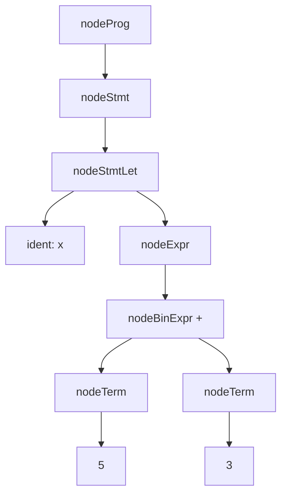

# Atom C++ Compiler

Минималистичный и очень простой компилятор, реализованный на языке C++. \
Поддерживает:
- инициализацию
- переприсваивание
- условия
- арифметические операции

## Сборка


```bash
git clone https://github.com/dasha379/atom
cd atom
mkdir build
cmake -S . -B build
cmake --build build
```

## Запуск
```bash
cd build
# копиляция программы
./atom ../test.at
# запуск скомпилированного файла
./out
# просмотр кода возврата
echo $?
```

## Структура

**src/tokenization.hpp** -- отвечает за лексический анализ. Текст преобразуется в токены. \
**src/parser.hpp** -- отвечает за синтаксческий анализ, построение синтаксического дерева. \
**src/arena.hpp** -- отвечает за управление памятью. Выделяется большой блок памяти и далее по мере необходимости выделяются более мелкие кусочки памяти для синтаксческого дерева. \
**src/generation.hpp** -- отвечает за генерацию кода ассемблера. Синтаксическое дерево обходится сверху вниз: (для выражения let x = 5 + 3)


## Требования

- CMake 3.20+
- Компилятор с поддержкой C++17 (g++/clang)
- NASM (для ассемблирования)

```bash
# Установка зависимостей (Ubuntu/Debian)
sudo apt install cmake g++ nasm
```
